# Exam template for 02476 Machine Learning Operations

This is the report template for the exam. Please only remove the text formatted as with three dashes in front and behind
like:

```--- question 1 fill here ---```

Where you instead should add your answers. Any other changes may have unwanted consequences when your report is
auto-generated at the end of the course. For questions where you are asked to include images, start by adding the image
to the `figures` subfolder (please only use `.png`, `.jpg` or `.jpeg`) and then add the following code in your answer:

``

In addition to this markdown file, we also provide the `report.py` script that provides two utility functions:

Running:

```bash
python report.py html
```

Will generate a `.html` page of your report. After the deadline for answering this template, we will auto-scrape
everything in this `reports` folder and then use this utility to generate a `.html` page that will be your serve
as your final hand-in.

Running

```bash
python report.py check
```

Will check your answers in this template against the constraints listed for each question e.g. is your answer too
short, too long, or have you included an image when asked. For both functions to work you mustn't rename anything.
The script has two dependencies that can be installed with

```bash
pip install typer markdown
```

or

```bash
uv add typer markdown
```

## Overall project checklist

The checklist is *exhaustive* which means that it includes everything that you could do on the project included in the
curriculum in this course. Therefore, we do not expect at all that you have checked all boxes at the end of the project.
The parenthesis at the end indicates what module the bullet point is related to. Please be honest in your answers, we
will check the repositories and the code to verify your answers.

### Week 1

* [x] Create a git repository (M5)
* [x] Make sure that all team members have write access to the GitHub repository (M5)
* [x] Create a dedicated environment for you project to keep track of your packages (M2)
* [x] Create the initial file structure using cookiecutter with an appropriate template (M6)
* [x] Fill out the `data.py` file such that it downloads whatever data you need and preprocesses it (if necessary) (M6)
* [x] Add a model to `model.py` and a training procedure to `train.py` and get that running (M6)
* [x] Remember to either fill out the `requirements.txt`/`requirements_dev.txt` files or keeping your
    `pyproject.toml`/`uv.lock` up-to-date with whatever dependencies that you are using (M2+M6)
* [x] Remember to comply with good coding practices (`pep8`) while doing the project (M7)
* [x] Do a bit of code typing and remember to document essential parts of your code (M7)
* [x] Setup version control for your data or part of your data (M8)
* [x] Add command line interfaces and project commands to your code where it makes sense (M9) (notation: project commands exist in `tasks.py`, but full CLI entry points are not consistently set up)
* [x] Construct one or multiple docker files for your code (M10)
* [x] Build the docker files locally and make sure they work as intended (M10)
* [x] Write one or multiple configurations files for your experiments (M11)
* [x] Used Hydra to load the configurations and manage your hyperparameters (M11)
* [x] Use profiling to optimize your code (M12)
* [x] Use logging to log important events in your code (M14)
* [x] Use Weights & Biases to log training progress and other important metrics/artifacts in your code (M14)
* [x] Consider running a hyperparameter optimization sweep (M14)
* [ ] Use PyTorch-lightning (if applicable) to reduce the amount of boilerplate in your code (M15)

### Week 2

* [x] Write unit tests related to the data part of your code (M16)
* [x] Write unit tests related to model construction and or model training (M16)
* [x] Calculate the code coverage (M16)
* [x] Get some continuous integration running on the GitHub repository (M17)
* [x] Add caching and multi-os/python/pytorch testing to your continuous integration (M17)
* [x] Add a linting step to your continuous integration (M17)
* [x] Add pre-commit hooks to your version control setup (M18)
* [x] Add a continues workflow that triggers when data changes (M19)
* [x] Add a continues workflow that triggers when changes to the model registry is made (M19)
* [x] Create a data storage in GCP Bucket for your data and link this with your data version control setup (M21)
* [x] Create a trigger workflow for automatically building your docker images (M21)
* [x] Get your model training in GCP using either the Engine or Vertex AI (M21)
* [x] Create a FastAPI application that can do inference using your model (M22)
* [x] Deploy your model in GCP using either Functions or Run as the backend (M23)
* [x] Write API tests for your application and setup continues integration for these (M24)
* [x] Load test your application (M24)
* [ ] Create a more specialized ML-deployment API using either ONNX or BentoML, or both (M25)
* [x] Create a frontend for your API (M26)

### Week 3

* [x] Check how robust your model is towards data drifting (M27)
* [x] Setup collection of input-output data from your deployed application (M27)
* [ ] [started but not finished] Deploy to the cloud a drift detection API (M27)
* [x] Instrument your API with a couple of system metrics (M28)
* [ ] Setup cloud monitoring of your instrumented application (M28)
* [x] Create one or more alert systems in GCP to alert you if your app is not behaving correctly (M28)
* [x] If applicable, optimize the performance of your data loading using distributed data loading (M29)
* [ ] [started but not finished] If applicable, optimize the performance of your training pipeline by using distributed training (M30)
* [ ] Play around with quantization, compilation and pruning for you trained models to increase inference speed (M31)

### Extra

* [ ] Write some documentation for your application (M32)
* [ ] Publish the documentation to GitHub Pages (M32)
* [x] Revisit your initial project description. Did the project turn out as you wanted?
* [ ] [only described as text] Create an architectural diagram over your MLOps pipeline
* [x] Make sure all group members have an understanding about all parts of the project
* [x] Uploaded all your code to GitHub

## Group information

### Question 1
> **Enter the group number you signed up on <learn.inside.dtu.dk>**
>
> Answer:

- 18

### Question 2
> **Enter the study number for each member in the group**
>
> Example:
>
> *sXXXXXX, sXXXXXX, sXXXXXX*
>
> Answer:

- s241614
- s242843
- s251155
- s250130
- s252746

### Question 3
> **Did you end up using any open-source frameworks/packages not covered in the course during your project? If so**
> **which did you use and how did they help you complete the project?**
>
> Recommended answer length: 0-200 words.
>
> Example:
> *We used the third-party framework ... in our project. We used functionality ... and functionality ... from the*
> *package to do ... and ... in our project*.
>
> Answer:

We used the open-source framework Evidently for data and model drift analysis, which was not covered in the course. Evidently allowed us to compare reference data with newly observed input data and detect changes in their underlying distributions over time. This made it possible to evaluate whether the deployed model was operating on data that differed significantly from what it was trained on. By providing clear drift metrics and summaries, Evidently helped us assess the model's robustness to changing data conditions and supported early identification of potential issues related to data drift in a realistic deployment setting.


## Coding environment

> In the following section we are interested in learning more about you local development environment. This includes
> how you managed dependencies, the structure of your code and how you managed code quality.

### Question 4

> **Explain how you managed dependencies in your project? Explain the process a new team member would have to go**
> **through to get an exact copy of your environment.**
>
> Recommended answer length: 100-200 words
>
> Example:
> *We used ... for managing our dependencies. The list of dependencies was auto-generated using ... . To get a*
> *complete copy of our development environment, one would have to run the following commands*
>
> Answer:

We used `uv` to manage our dependencies. Whenever functionality was added, we used `uv add` (when appropriate with the `--dev` flag) to introduce a new package and its dependencies, while letting `uv` auto-resolve conflicts. Some additional work was done in `pyproject.toml` for the PyTorch dependency setup, using environment markers for wheel selection.

A new team member can clone the repo, install `uv`, and run `uv sync --frozen` from the project root, since the exact dependency resolution is stored in `uv.lock`. If the training data is also needed, they must authenticate with GCP, have permissions for the GCS bucket, and run `uv run dvc pull`.

### Question 5

> **We expect that you initialized your project using the cookiecutter template. Explain the overall structure of your**
> **code. What did you fill out? Did you deviate from the template in some way?**
>
> Recommended answer length: 100-200 words
>
> Example:
> *From the cookiecutter template we have filled out the ... , ... and ... folder. We have removed the ... folder*
> *because we did not use any ... in our project. We have added an ... folder that contains ... for running our*
> *experiments.*
>
> Answer:

We used the `code_helpers` branch of the MLOps template as our cookiecutter base, which included some agent commands.
The overall structure has been maintained, with additional subfolders such as `tests/integrationtests`, `tests/unittests`, and `configs/experiment` to better organize tests and experiment configurations. We added an `outputs/` folder for logging, and folders like `models/` are present but configured to not track their contents in git (only their structure). Additional runtime folders (e.g., `wandb/`, `.dvc/`, caches) may appear as needed while executing certain features. We removed the `notebooks/` and `docs/` folders as we ended up not using either of them.

### Question 6

> **Did you implement any rules for code quality and format? What about typing and documentation? Additionally,**
> **explain with your own words why these concepts matters in larger projects.**
>
> Recommended answer length: 100-200 words.
>
> Example:
> *We used ... for linting and ... for formatting. We also used ... for typing and ... for documentation. These*
> *concepts are important in larger projects because ... . For example, typing ...*
>
> Answer:

We used `ruff` for linting and formatting, configured via `ruff.toml` with the lints and formatting rules we preferred. We also configured special cases in the repo (e.g., the `wandb/` folder in the project root) to avoid confusing the tooling when writing imports such as `import wandb`.

We agreed on `mypy` for enforcing general typing guidelines and did some configuration to make it work for our setup.
We kept documentation requirements more liberal: docstrings were preferred but not enforced.

These code quality measures (plus additional checks and fixes) were enforced locally through pre-commit hooks and in CI through the pre-commit workflow.

These concepts matter in larger projects because developers have different skill levels and different definitions of "good" practices. Agreeing on a shared set of rules and enforcing them via tools makes the codebase more consistent, reduces friction in pull request reviews, and improves overall code quality.

## Version control

> In the following section we are interested in how version control was used in your project during development to
> corporate and increase the quality of your code.

### Question 7

> **How many tests did you implement and what are they testing in your code?**
>
> Recommended answer length: 50-100 words.
>
> Example:
> *In total we have implemented X tests. Primarily we are testing ... and ... as these the most critical parts of our*
> *application but also ... .*
>
> Answer:

In total, we implemented performance tests, unit tests, and integration tests. The unit tests validate the most critical ML components: the data pipeline (dataset behavior plus distributed dataloader/sampler logic) and model correctness (successful construction and a forward pass producing outputs of the expected shape). The integration tests focus on the FastAPI service, verifying that core endpoints (`/`, `/health`, `/model`, `/predict`) and multiple `/admin/*` endpoints return correct status codes and response schemas, and that error handling works for invalid uploads. Finally, we include a Locust script for API load testing under traffic.

### Question 8

> **What is the total code coverage (in percentage) of your code? If your code had a code coverage of 100% (or close**
> **to), would you still trust it to be error free? Explain you reasoning.**
>
> Recommended answer length: 100-200 words.
>
> Example:
> *The total code coverage of code is X%, which includes all our source code. We are far from 100% coverage of our **
> *code and even if we were then...*
>
> Answer:

The total code coverage of our code is 63% for the `sign_ml` package. Even with ~100% coverage, we would not trust the code to be error free, since coverage only shows executed lines. It does not guarantee correct assertions, realistic scenarios, or robust handling of edge cases. Therefore, coverage is a helpful indicator for regression risk, not a proof of correctness.

Image 1:

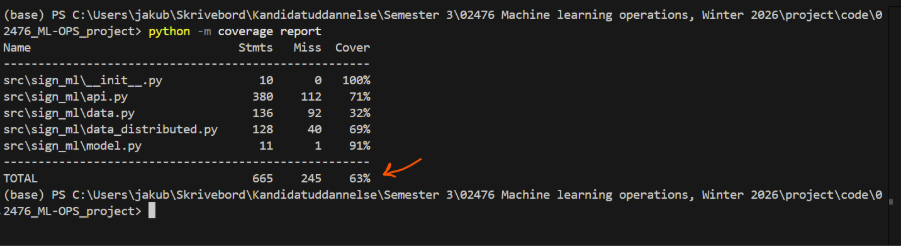

### Question 9

> **Did you workflow include using branches and pull requests? If yes, explain how. If not, explain how branches and**
> **pull request can help improve version control.**
>
> Recommended answer length: 100-200 words.
>
> Example:
> *We made use of both branches and PRs in our project. In our group, each member had an branch that they worked on in*
> *addition to the main branch. To merge code we ...*
>
> Answer:

We used both feature branches and PRs in our project. Each team member implemented changes in their own branch, sometimes with several colleagues on one branch if they worked on the same feature. To integrate changes, we created a pull request that required approval from two reviewers before it could be merged. When available, a Copilot review was triggered to reduce review load and speed up feedback cycles.

This setup enabled independent feature work while maintaining code quality through reviews.

### Question 10

> **Did you use DVC for managing data in your project? If yes, then how did it improve your project to have version**
> **control of your data. If no, explain a case where it would be beneficial to have version control of your data.**
>
> Recommended answer length: 100-200 words.
>
> Example:
> *We did make use of DVC in the following way: ... . In the end it helped us in ... for controlling ... part of our*
> *pipeline*
>
> Answer:

Yes, we used DVC in combination with GCP in our project. We used the data version control library DVC, which can store data on Google Cloud Storage (GCS) as the remote data backend. Here, the raw data, processed data, as well as the model artifacts, were stored on the GCS bucket, while the lightweight files were stored on the Git repository. We were hence able to version files without having them stored on the Git repository.

Working with GCP through DVC helped us improve the project in several ways. First, reproducibility was attained because a Git commit would always have been tied to a certain data version stored on GCS. This meant that any team member would have been able to easily reproduce these experiments just by checking out a certain Git commit, then calling dvc pull to fetch that data. Secondly, GCS helped us improve collaboration since a team would only need a single source of data.
In general, applying DVC along with GCP facilitated effective management of data versioning, a clean data repository, and a reproducible ML pipeline.

### Question 11

> **Discuss you continuous integration setup. What kind of continuous integration are you running (unittesting,**
> **linting, etc.)? Do you test multiple operating systems, Python  version etc. Do you make use of caching? Feel free**
> **to insert a link to one of your GitHub actions workflow.**
>
> Recommended answer length: 200-300 words.
>
> Example:
> *We have organized our continuous integration into 3 separate files: one for doing ..., one for running ... testing*
> *and one for running ... . In particular for our ..., we used ... .An example of a triggered workflow can be seen*
> *here: <weblink>*
>
> Answer:

We have five different active GitHub Actions workflows. One targets updating pre-commit versions and runs once weekly to align with the Dependabot setup. Another is a per-PR Docker build workflow that does not use caching between runs on different VMs; therefore, we kept it PR-only to reduce compute overhead (a later GCP solution is preferred).

The remaining three are triggered on push or PR to `main`:

The first workflow runs pre-commit on all files, performs auto-fixes where possible, and creates another commit on the branch if changes were made. This ensures code quality measures cannot be bypassed when merging to `main`.
Example: https://github.com/Fabius-Naumann/02476_ML-OPS_project/actions/runs/21099547835/job/60681738206

The second workflow performs explicit linter/formatter/type-checker validation. While pre-commit may auto-fix issues and still show a successful check, this workflow functions as a strict compliance signal for PRs.
Example: https://github.com/Fabius-Naumann/02476_ML-OPS_project/actions/runs/21217692542/job/61043420749

The third workflow runs tests on Linux, Windows, and macOS for Python 3.12 and 3.13.
Example: https://github.com/Fabius-Naumann/02476_ML-OPS_project/actions/runs/21217692615

## Running code and tracking experiments

> In the following section we are interested in learning more about the experimental setup for running your code and
> especially the reproducibility of your experiments.

### Question 12

> **How did you configure experiments? Did you make use of config files? Explain with coding examples of how you would**
> **run a experiment.**
>
> Recommended answer length: 50-100 words.
>
> Example:
> *We used a simple argparser, that worked in the following way: Python  my_script.py --lr 1e-3 --batch_size 25*
>
> Answer:

We configured experiments using Hydra with YAML config files. A base config in `config.yaml` selects an experiment (default: `exp1`) and stores shared settings like device and output paths. Per-experiment YAML files in `configs/experiment/` (e.g., `exp1.yaml`, `exp2.yaml`) define hyperparameters such as batch size, epochs, learning rate, and data-loading options. We run experiments by selecting an experiment config or overriding parameters from the command line, e.g.:

```bash
python -m sign_ml.train experiment=exp1
python -m sign_ml.train experiment.training.epochs=10 experiment.training.batch_size=64 experiment.optimizer.lr=0.001
```

This setup makes experiments reproducible and easy to compare.

### Question 13

> **Reproducibility of experiments are important. Related to the last question, how did you secure that no information**
> **is lost when running experiments and that your experiments are reproducible?**
>
> Recommended answer length: 100-200 words.
>
> Example:
> *We made use of config files. Whenever an experiment is run the following happens: ... . To reproduce an experiment*
> *one would have to do ...*
>
> Answer:

We secured reproducibility primarily through versioned configs and logged run metadata. Training and evaluation are driven by Hydra YAML configs in config.yaml and `configs/experiment/exp*.yaml`, so hyperparameters, seeds, and paths are stored as code and can be re-used exactly. When running, sign_ml.train logs the full resolved configuration (`OmegaConf.to_yaml(cfg)`) and writes logs to a timestamped `outputs/<date>/<time>/train.log`, ensuring the exact settings for each run are preserved. We also control randomness by storing a seed per experiment and calling `_set_seed(seed)`, enabling deterministic PyTorch behavior where possible. For data reproducibility, the dataset is tracked with DVC (`data.dvc`), so the same data version can be pulled again. Finally, we lock dependencies using `uv.lock`, and (when enabled) we log metrics and model artifacts to Weights & Biases, making runs easy to compare and reproduce across machines.

### Question 14

> **Upload 1 to 3 screenshots that show the experiments that you have done in W&B (or another experiment tracking**
> **service of your choice). This may include loss graphs, logged images, hyperparameter sweeps etc. You can take**
> **inspiration from [this figure](figures/wandb.png). Explain what metrics you are tracking and why they are**
> **important.**
>
> Recommended answer length: 200-300 words + 1 to 3 screenshots.
>
> Example:
> *As seen in the first image when have tracked ... and ... which both inform us about ... in our experiments.*
> *As seen in the second image we are also tracking ... and ...*
>
> Answer:

In our Weights & Biases (W&B) experiment tracking we logged both training and validation metrics to monitor learning progress, detect overfitting, and compare hyperparameter choices across runs.

Screenshot 1 shows the learning curves for train/loss, val/loss, train/accuracy, and val/accuracy across epochs. We track loss because it directly reflects how well the model optimizes the objective function and is usually more sensitive than accuracy early in training. We track accuracy because it is an easy-to-interpret performance metric for classification and aligns with our final goal: correct traffic sign predictions. Comparing training vs. validation curves is important: if train/accuracy keeps increasing while val/accuracy plateaus or val/loss increases, it indicates overfitting and suggests we should reduce model capacity, add regularization, or stop earlier.

Screenshot 2 illustrates our hyperparameter sweep, where the sweep objective is to maximize validation/accuracy. We varied key hyperparameters such as learning rate, batch size, and number of epochs, and visualized how each setting correlates with validation accuracy. This helps us pick a configuration that generalizes well rather than just performing well on the training set.

Overall, these metrics let us verify that training is stable, select the best-performing run based on validation performance, and justify hyperparameter choices with evidence from multiple comparable experiments.

Screenshot 1:

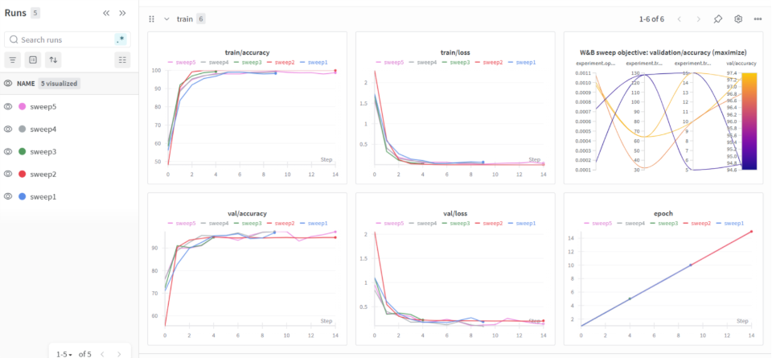

Screenshot 2:

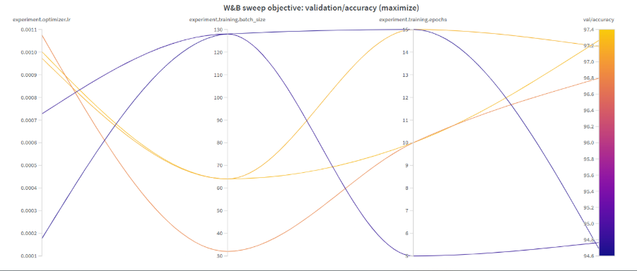


### Question 15

> **Docker is an important tool for creating containerized applications. Explain how you used docker in your**
> **experiments/project? Include how you would run your docker images and include a link to one of your docker files.**
>
> Recommended answer length: 100-200 words.
>
> Example:
> *For our project we developed several images: one for training, inference and deployment. For example to run the*
> *training docker image: `docker run trainer:latest lr=1e-3 batch_size=64`. Link to docker file: <weblink>*
>
> Answer:

Docker was used to containerize our ML application to ensure reproducible training and deployment. We created separate Docker images for model training and API-based inference, each with its own Dockerfile. The images are automatically built using GitHub Actions to verify the project can always be containerized. The training image runs the full training pipeline, while the API image exposes a FastAPI service for inference and evaluation.

### Question 16

> **When running into bugs while trying to run your experiments, how did you perform debugging? Additionally, did you**
> **try to profile your code or do you think it is already perfect?**
>
> Recommended answer length: 100-200 words.
>
> Example:
> *Debugging method was dependent on group member. Some just used ... and others used ... . We did a single profiling*
> *run of our main code at some point that showed ...*
>
> Answer:

When we ran into bugs, we mainly debugged by reading the full traceback and then reproducing the error with the smallest possible command (e.g., running `train.py`/`evaluate.py` with a fixed config and `epochs=1`). Many issues were related to configuration and paths, so we verified Hydra/OmegaConf resolution and ensured required environment variables (e.g. `PROJECT_ROOT`) were set consistently when running from different working directories. For data/model issues we validated dataset sizes, tensor shapes, label ranges, and device placement (CPU vs GPU), and added minimal logging around the failing sections (resolved paths, batch shapes, current epoch) to localize the problem quickly.

We did not assume the code was perfect. We used both Python-level profiling (`cProfile`) and PyTorch profiling (`torch.profiler` exported to TensorBoard) on short, controlled runs (e.g., a small number of batches) to keep traces manageable and focus on the hot path. Profiling showed that Weights & Biases logging could dominate runtime and hide the true bottlenecks, so we disabled W&B during profiling to measure the actual training/evaluation workload, while keeping it enabled for sweeps to preserve experiment tracking and visualizations.

## Working in the cloud

> In the following section we would like to know more about your experience when developing in the cloud.

### Question 17

> **List all the GCP services that you made use of in your project and shortly explain what each service does?**
>
> Recommended answer length: 50-200 words.
>
> Example:
> *We used the following two services: Engine and Bucket. Engine is used for... and Bucket is used for...*
>
> Answer:

We used the following services in Google Cloud Platform (GCP):

- Vertex AI: Used for managed training jobs and executing the ML workflow in a controlled environment.
- Cloud Storage (GCS): Used as the central storage layer. DVC tracks datasets and model artifacts here, and we also store training outputs such as models and logs.
- Artifact Registry: Used for storing and maintaining Docker images (e.g., the containerized FastAPI backend) so they can be deployed more easily.

Together, these services enable the ML cycle from data storage to model training to containerized backend deployment.

### Question 18

> **The backbone of GCP is the Compute engine. Explained how you made use of this service and what type of VMs**
> **you used?**
>
> Recommended answer length: 100-200 words.
>
> Example:
> *We used the compute engine to run our ... . We used instances with the following hardware: ... and we started the*
> *using a custom container: ...*
>
> Answer:

While Compute Engine could be considered the backbone of GCP, in our case, we did not use Compute Engine VMs directly, as our project has been implemented with the power of Vertex AI, which in its turn utilizes Compute Engine behind the scenes, abstracting from its complexity.

Our ML jobs were executed using the Vertex AI. For instance, instead of manually creating virtual machines, we used the Vertex AI to submit the jobs, which were executed internally using the Google Cloud Platform. This avoided us the hassle of creating, as well as scaling, the virtual machines.

For training, Vertex AI has managed worker nodes where different pre-defined virtual machine types are available to support ML workloads, e.g., CPU instances for initial experiments and data processing.

The training jobs in Vertex AI operate in isolated environments, like virtual machines without us having to manage networking and OS configurations.

In summary, though Compute Engine was the infrastructure system, Vertex AI was the interface through which we could utilize these infrastructure systems in a managed, scalable, and production mode.

### Question 19

> **Insert 1-2 images of your GCP bucket, such that we can see what data you have stored in it.**
> **You can take inspiration from [this figure](figures/bucket.png).**
>
> Answer:

Image 1: Cloud Storage (GCS) usage

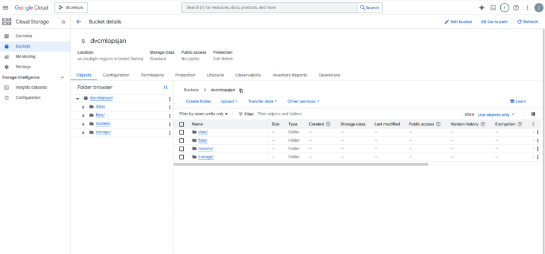

Figure: Google Cloud Storage bucket used in the project. The bucket stores datasets (`data/`), trained model artifacts (`models/`), and supporting files tracked via DVC.

Image 2: Example stored datasets and artifacts

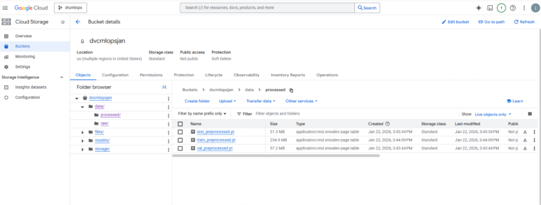
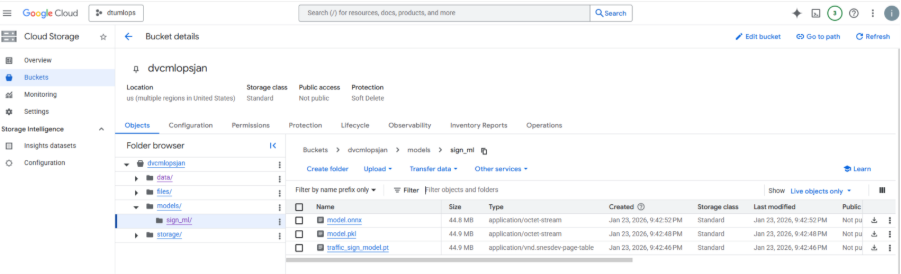


### Question 20

> **Upload 1-2 images of your GCP artifact registry, such that we can see the different docker images that you have**
> **stored. You can take inspiration from [this figure](figures/registry.png).**
>
> Answer:

Image 1: Artifact Registry repositories used to store Docker images for the project.

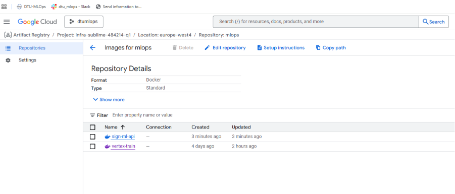

Image 2: Docker images stored in Artifact Registry

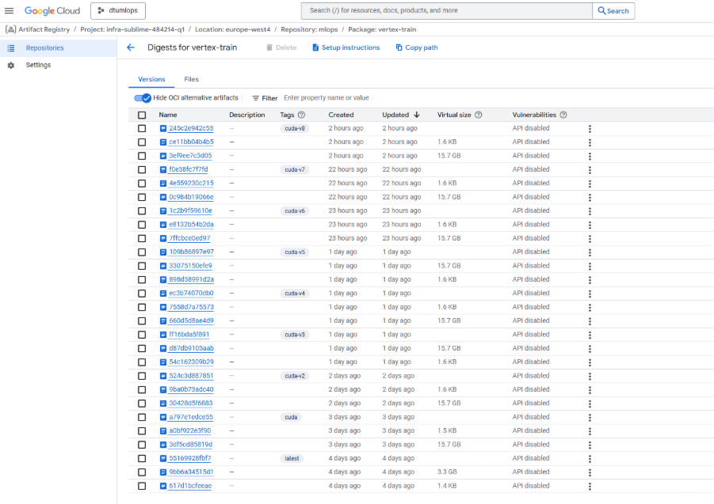
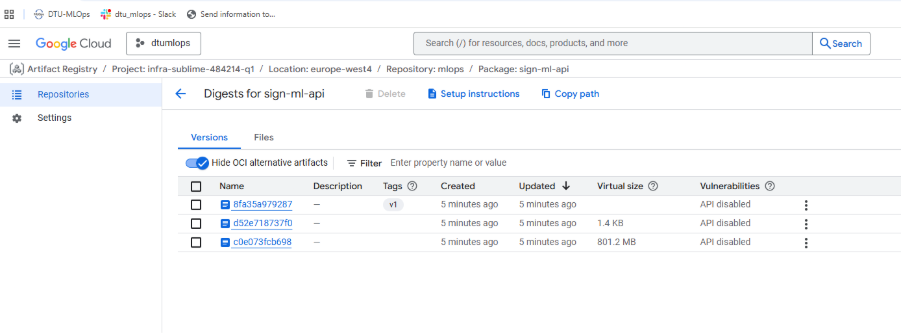


### Question 21

> **Upload 1-2 images of your GCP cloud build history, so we can see the history of the images that have been build in**
> **your project. You can take inspiration from [this figure](figures/build.png).**
>
> Answer:

Note: Cloud Build was enabled in the project but not actively used. Docker images were built locally and pushed directly to Artifact Registry; therefore, no Cloud Build history is available.

Image 1:

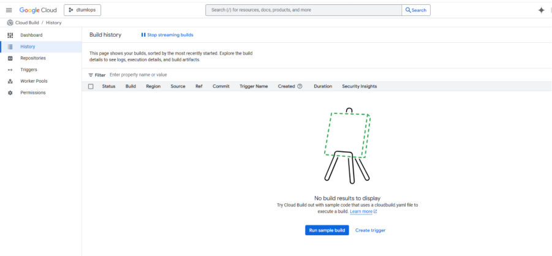

### Question 22

> **Did you manage to train your model in the cloud using either the Engine or Vertex AI? If yes, explain how you did**
> **it. If not, describe why.**
>
> Recommended answer length: 100-200 words.
>
> Example:
> *We managed to train our model in the cloud using the Engine. We did this by ... . The reason we choose the Engine*
> *was because ...*
>
> Answer:

Yes, we were able to train the model on the cloud using Vertex AI.

We made use of Vertex AI in the training of our model as opposed to training it locally or making it run on Compute Engine virtual machines. This involved preparing the training code to run as a Vertex AI training job and providing it with appropriate data to run from Google Cloud Storage. On submitting it as a training job, it automatically runs and manages its own infrastructure and other appropriate resources like machines and isolation.

We chose Vertex AI because it removes much of the operational complexity from standing up and running Compute Engine instances. We were thus able to devote more of our time to model development and experiment reproducibility instead of infrastructure setup itself. Furthermore, Vertex AI integrates well with Cloud Storage, which is something that felt natural to us in terms of DVC usage.

Overall, the process of working through Vertex AI was a scalable, reproducible, and production-ready way to train our model in the cloud.

Image 1:

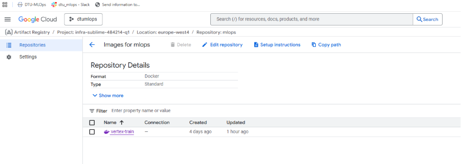

## Deployment

### Question 23

> **Did you manage to write an API for your model? If yes, explain how you did it and if you did anything special. If**
> **not, explain how you would do it.**
>
> Recommended answer length: 100-200 words.
>
> Example:
> *We did manage to write an API for our model. We used FastAPI to do this. We did this by ... . We also added ...*
> *to the API to make it more ...*
>
> Answer:

We implemented an API for our model using FastAPI. The service loads a trained PyTorch model once at startup via a FastAPI lifespan hook (configurable with SIGN_ML_MODEL_PATH and SIGN_ML_DEVICE), so inference requests are fast. It exposes GET /health and GET /model for readiness and metadata, and POST /predict for inference. The predict endpoint accepts an uploaded image, validates the content type, enforces a max upload size and pixel limit, decodes with PIL, applies preprocessing (resize + normalization), and runs inference in torch.inference_mode(). The response returns the predicted class and softmax probabilities. We also added admin endpoints to trigger training/evaluation/tests as background jobs with concurrency limits and log tails.

### Question 24

> **Did you manage to deploy your API, either in locally or cloud? If not, describe why. If yes, describe how and**
> **preferably how you invoke your deployed service?**
>
> Recommended answer length: 100-200 words.
>
> Example:
> *For deployment we wrapped our model into application using ... . We first tried locally serving the model, which*
> *worked. Afterwards we deployed it in the cloud, using ... . To invoke the service an user would call*
> *`curl -X POST -F "file=@file.json"<weburl>`*
>
> Answer:

The API was deployed locally using Docker. The FastAPI application and its dependencies were packaged into a Docker image, ensuring a reproducible runtime environment. The container can be built and run locally, exposing the API on a specified port. Inference requests can be sent using standard HTTP calls, for example by posting an image file to the prediction endpoint using `curl`. While the API was not deployed to a managed cloud service, the containerized setup allows straightforward deployment to cloud-based container platforms with minimal code changes.

### Question 25

> **Did you perform any functional testing and load testing of your API? If yes, explain how you did it and what**
> **results for the load testing did you get. If not, explain how you would do it.**
>
> Recommended answer length: 100-200 words.
>
> Example:
> *For functional testing we used pytest with httpx to test our API endpoints and ensure they returned the correct*
> *responses. For load testing we used locust with 100 concurrent users. The results of the load testing showed that*
> *our API could handle approximately 500 requests per second before the service crashed.*
>
> Answer:

We performed testing with pytest. Unit tests cover core components like model construction/forward pass and data handling. In addition, we wrote integration tests for the FastAPI app using FastAPI’s TestClient, exercising /health, /model, and /predict, including error cases (wrong content type, empty uploads, oversized uploads, corrupt images) and admin endpoints by stubbing background jobs for deterministic behavior. For load testing, we prepared a Locust script that simulates users calling read endpoints and repeatedly posting small images to /predict to measure latency and throughput under concurrency. In this project we did not record formal load-test metrics.

### Question 26

> **Did you manage to implement monitoring of your deployed model? If yes, explain how it works. If not, explain how**
> **monitoring would help the longevity of your application.**
>
> Recommended answer length: 100-200 words.
>
> Example:
> *We did not manage to implement monitoring. We would like to have monitoring implemented such that over time we could*
> *measure ... and ... that would inform us about this ... behaviour of our application.*
>
> Answer:

We did not fully implement monitoring for the developed model as part of this project due to time and scope limitations. The primary focus was on building a complete end-to-end ML pipeline, covering data versioning, cloud-based model training, containerization, and deployment. Implementing proper model monitoring would have required additional configuration and setup beyond the project scope.

That said, monitoring would play an important role in ensuring the long-term reliability of the application. By using services such as Vertex AI Model Monitoring or Cloud Monitoring, we could track key metrics such as prediction latency, error rates, usage patterns, and data drift. For example, monitoring input data distributions would help identify when incoming data starts to diverge from the training data, which can gradually reduce model accuracy.

In a production environment, these signals could be used to trigger alerts or retraining workflows, helping keep the model accurate, stable, and reliable as data and usage patterns evolve over time.

## Overall discussion of project

> In the following section we would like you to think about the general structure of your project.

### Question 27

> **How many credits did you end up using during the project and what service was most expensive? In general what do**
> **you think about working in the cloud?**
>
> Recommended answer length: 100-200 words.
>
> Example:
> *Group member 1 used ..., Group member 2 used ..., in total ... credits was spend during development. The service*
> *costing the most was ... due to ... . Working in the cloud was ...*
>
> Answer:

The project tracked our usage through the GCP billing dashboard during our project work without assigning precise credit consumption to each group member. The total credits used during the project stayed within the free course credits because the project budget did not exceed its limits. The majority of expenses occurred during the testing process and model development which resulted in higher costs than either storage or deployment expenses.

The service with the highest cost was Vertex AI because it required managed training jobs to operate. The system requires computational power for all training durations which results in higher expenses than Cloud Storage because its costs increase at a slower rate when users maintain low storage requirements. Docker images had low usage in Artifact Registry because users built and stored them on rare occasions.

The cloud environment provided a beneficial work experience. The project achieved better simulation of actual MLOps operations through its features which enabled scalable operations and reproducible results and provided users with scalable managed services. Building production-ready ML systems requires users to understand costs which serves as a critical learning outcome for this process.

### Question 28

> **Did you implement anything extra in your project that is not covered by other questions? Maybe you implemented**
> **a frontend for your API, use extra version control features, a drift detection service, a kubernetes cluster etc.**
> **If yes, explain what you did and why.**
>
> Recommended answer length: 0-200 words.
>
> Example:
> *We implemented a frontend for our API. We did this because we wanted to show the user ... . The frontend was*
> *implemented using ...*
>
> Answer:

Yes, we implemented a few additional components that go beyond the core requirements covered by the other questions.

The frontend application we developed connects directly to our backend inference API. The frontend was designed to improve usability while showing the full process from user input to model prediction. Users can submit inputs through the UI to view model outputs instead of using raw API calls, which makes the project easier to assess and demonstrate.

Our team used DVC for data version control at an advanced level beyond the basic setup requirements (M8). We versioned datasets and model artifacts stored in Google Cloud Storage, which allowed us to reproduce experiments and monitor how data changes impacted training results over time.

These extensions introduced a user-facing interface and additional real-world ML application elements, although we lacked the resources to build advanced features like a dedicated drift detection service or Kubernetes-based deployment.

### Question 29

> **Include a figure that describes the overall architecture of your system and what services that you make use of.**
> **You can take inspiration from [this figure](figures/overview.png). Additionally, in your own words, explain the**
> **overall steps in figure.**
>
> Recommended answer length: 200-400 words
>
> Example:
>
> *The starting point of the diagram is our local setup, where we integrated ... and ... and ... into our code.*
> *Whenever we commit code and push to GitHub, it auto triggers ... and ... . From there the diagram shows ...*
>
> Answer:

The architecture starts in our local development environment, where we maintain the codebase and dependencies with `uv`/`uv.lock` to ensure reproducible installs across machines. Experiments are configured via Hydra YAML files (`configs/config.yaml` plus per-experiment configs), which define hyperparameters, paths, and runtime options.

Data and model artifacts are versioned with DVC. The repository tracks the `data/` directory with DVC and uses a Google Cloud Storage (GCS) bucket as the DVC remote. This enables reproducible training because each git commit can be paired with an exact data version that can be restored via `dvc pull`.

Whenever code is pushed or a PR is opened, GitHub Actions runs automated checks (linting/formatting/typing where enabled) and executes the test suite across multiple OS and Python versions. We also added workflows that react to data changes: when DVC files change in a PR, CI pulls the corresponding data from GCS, computes dataset statistics, and posts a small markdown report back to the PR (CML comment). This gives fast feedback when data changes might impact the pipeline.

Training runs can be executed locally (Docker or direct `uv run`) and were also executed in the cloud using Vertex AI. For cloud training, the training code runs as a managed job that reads the dataset from GCS and writes resulting model artifacts back to cloud storage. During training and evaluation we log metrics (loss/accuracy) and artifacts to Weights & Biases to make runs comparable and reproducible. Docker images are built for the training and inference workloads, and images can be stored in Artifact Registry for distribution.

For serving, we provide a FastAPI inference service packaged in Docker. The service loads the trained model at startup, exposes prediction endpoints, and includes Prometheus-compatible `/metrics` for observability. We also log input/output summaries for inference requests to support later analysis (e.g., drift checks). A lightweight frontend can call the API to provide an end-to-end user flow from image upload to prediction.

Through this setup, we managed implementing quite some MLOps features but certain aspects could be better connected and tested. The whole workflow is definetly far from optimised and continuous workflow integrations with the cloud should be even more improved in case the project was to be continued.

### Question 30

> **Discuss the overall struggles of the project. Where did you spend most time and what did you do to overcome these**
> **challenges?**
>
> Recommended answer length: 200-400 words.
>
> Example:
> *The biggest challenges in the project was using ... tool to do ... . The reason for this was ...*
>
> Answer:

The overall project proved to be significantly more challenging than initially anticipated, primarily due to the complexity of building a complete, end-to-end MLOps pipeline within a very limited timeframe. Although the chosen machine-learning task itself was deliberately kept relatively simple, the surrounding infrastructure required to support training, deployment, monitoring, and reproducibility introduced a steep learning curve. A major struggle was working with cloud infrastructure, particularly Google Cloud Platform (GCP).

Setting up authentication, permissions, services, and deployments required substantial trial and error, and debugging cloud-related issues was often time-consuming due to limited feedback and opaque error messages. This resulted in a large portion of the project time being spent on infrastructure rather than on model development itself. Another significant challenge was Dockerization. Building Docker images was resource-intensive and slow, especially when dealing with large dependencies and image sizes. Pushing images to remote registries further amplified this issue. Even minor code changes frequently required rebuilding and redeploying the entire pipeline, leading to long feedback loops and reduced iteration speed. This made rapid experimentation difficult and increased the cognitive load when debugging failures across multiple pipeline stages.

The overall system complexity was also a challenge. Integrating data processing, model training, CI/CD workflows, cloud deployment, and monitoring into a single coherent pipeline required understanding many tools and concepts simultaneously. The learning curve was steep, particularly within the three-week project window. These challenges were addressed through incremental debugging, careful documentation, extensive use of logs, and simplifying design decisions wherever possible. By prioritizing robustness and reproducibility over performance and scope, the project ultimately succeeded in demonstrating a functional MLOps pipeline, despite the inherent complexity and tight time constraints.

### Question 31

> **State the individual contributions of each team member. This is required information from DTU, because we need to**
> **make sure all members contributed actively to the project. Additionally, state if/how you have used generative AI**
> **tools in your project.**
>
> Recommended answer length: 50-300 words.
>
> Example:
> *Student sXXXXXX was in charge of developing of setting up the initial cookie cutter project and developing of the*
> *docker containers for training our applications.*
> *Student sXXXXXX was in charge of training our models in the cloud and deploying them afterwards.*
> *All members contributed to code by...*
> *We have used ChatGPT to help debug our code. Additionally, we used GitHub Copilot to help write some of our code.*
> Answer:


- Student s241614 was responsible for containerization and core infrastructure. This included building Docker images and validating local execution (M10), implementing unit tests for the data pipeline and model components with code coverage reporting (M16), and setting up a GitHub Actions workflow for automatic Docker builds on pushes and pull requests (M21). The student also implemented data-drift logging for deployed models (M27) and added Prometheus-compatible metrics for API monitoring, including request volume and latency (M28).

- Student s242843 was in charge of setting up the project (M2, M6), taking care of github administration (M5), providing a good coding practice setup (M7) and tying that to pre-commits (M18), implementing relevant CLIs and project commands (M9) as well as enabling various CI and CML workflows (M17, M19) + doing a lot of PR reviews.

- Student s251155 was responsible for the end-to-end experimentation and serving work in the project. Concretely, I created and maintained the Hydra configuration files for our experiments (M11) and integrated Hydra in the training code to manage hyperparameters consistently. I profiled key parts of the pipeline to identify bottlenecks and applied optimizations based on the results (M12). I implemented structured logging to capture important runtime events (M14), and integrated Weights & Biases to track training progress, metrics, and artifacts (M14). I also set up and executed a hyperparameter sweep to systematically explore model settings (M14). In addition, I implemented the FastAPI inference service for the trained model, evaluation, and testing (M22), wrote automated API tests and set up continuous integration to run them (M24), and created a Locust-based load test to evaluate API performance under high traffic (M24). Finally, I worked on distributed data loading to improve data pipeline performance where applicable (M29).
- Student s250130 worked on data ingestion and data preprocessing, preparing and structuring the datasets used in the project (M6, M8), also contributed to frontend development (M26) and worked with GCP services, including building Docker images and configuring Artifact Registry (M10, M21), as well as supporting cloud-based model training using Vertex AI (M25) and testing the full application end to end with Student s252746 (M21).
- Student s252746 was responsible for creating the machine learning model, training it, and evaluating its performance (M6), also worked on building Docker images compatible with Vertex AI for cloud training and deployment (M10, M21). Together with Student s250130, contributed to GCP-related tasks, including creating and configuring the Google Cloud Storage bucket for data and artifacts (M21), training the model in the cloud using Vertex AI (M21), integrating the Fast API backend with the frontend (M22, M26), and testing the full application end to end (M21)(M28).
